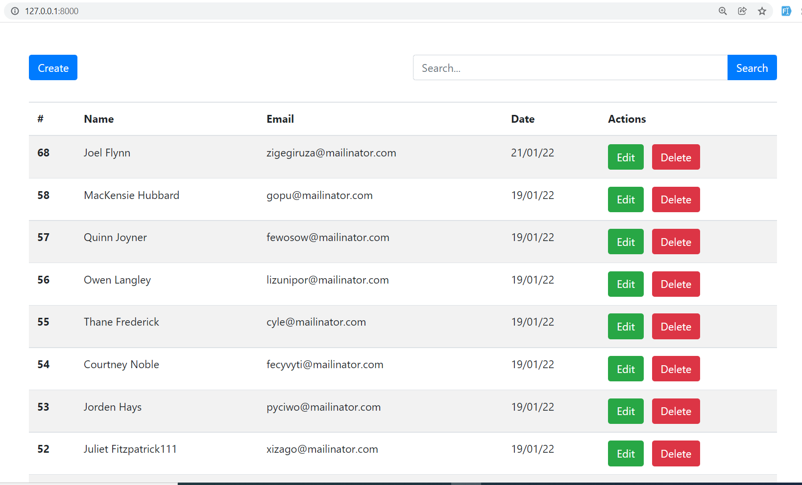

# Laravel SPA Using Jquery

## Installation

Clone the repo locally:

```
git clone https://github.com/HsuMonLynn/laravel-spa-crud-using-jquery.git
```

```
cd laravel-spa-crud-using-jquery
```

Install PHP dependencies:

```
composer install
```

Install NPM dependencies:

```
npm install
```

Build assets:

```
npm run dev
```

Setup configuration:

```
cp .env.example .env
```

Generate application key:

```
php artisan key:generate
```

Create database and configure in `.env` file

```
DB_CONNECTION=mysql
DB_HOST=127.0.0.1:3300
DB_PORT=3300
DB_DATABASE=laravel_vue_crud
DB_USERNAME=root
DB_PASSWORD=root
```

Run database migrations:

```
php artisan migrate
```

Run the dev server:

```
php artisan serve
```

Visit `localhost:8000` in your browser and login with:

## User List


## User Create


## User Edit


## User Delete


## User Search


## User Pagination
